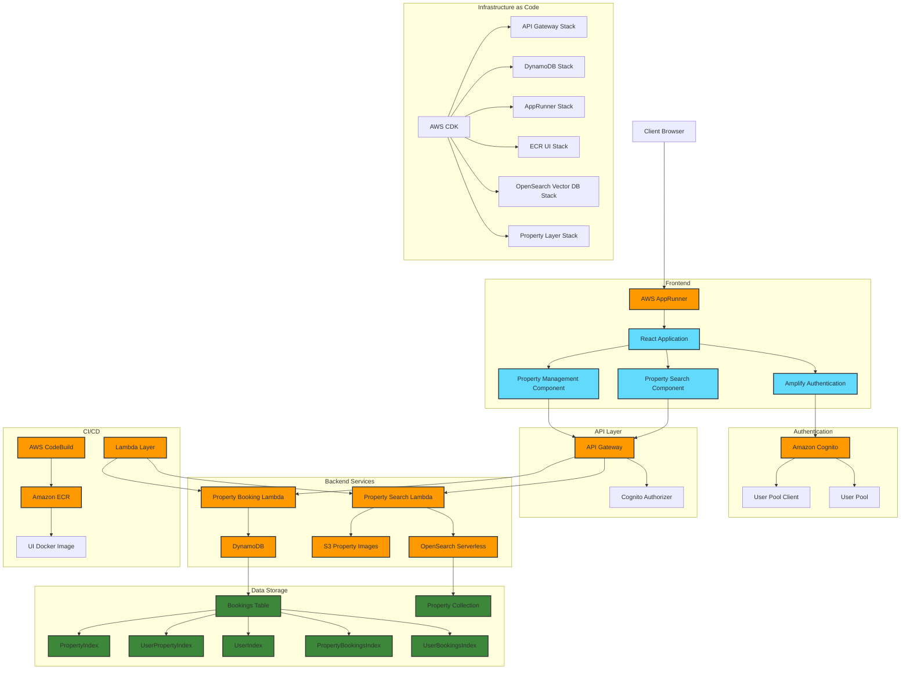

# Luxury Property Booking Application

### Built with Amazon Q Agentic Code Assistant and Cursor Agent

#### Documentation: https://deepwiki.com/Fraser27/booking-app-demo

A modern, serverless application for managing luxury property bookings. This application provides a seamless experience for property owners to list their properties and for guests to search and book luxury accommodations.

## Demo


**Property Search**


**Property Listing**


**Property Bookings**


## Architecture

The application is built using AWS serverless services:




- **Frontend**: React-based UI hosted on AWS AppRunner
- **Authentication**: Amazon Cognito for user authentication
- **API Layer**: Amazon API Gateway with Lambda integrations
- **Search**: Amazon OpenSearch for property search functionality
- **Storage**: 
  - Amazon S3 for property images
  - Amazon DynamoDB for booking data
- **Infrastructure**: AWS CDK for infrastructure as code

## Key Features

- Property listing and management
- Advanced property search with filters
- Secure booking system
- User authentication and authorization
- Property image management
- Real-time availability checking

## Prerequisites

- AWS account with appropriate permissions
- Access to AWS CloudShell
- Node.js 20.x
- Python 3.10
- AWS CDK 2.91.0
- Docker (for building the UI)

## Setup Instructions

### Option 1: Using AWS CloudShell (Recommended)

1. Log in to your AWS account and open AWS CloudShell
   

2. Clone the repository:
   ```bash
   git clone https://github.com/aws-samples/booking-app-demo.git
   cd booking-app-demo
   ```

3. Install dependencies:
   ```bash
   npm install -g aws-cdk@2.91.0
   python3 -m pip install -r requirements.txt
   ```

4. Bootstrap CDK in your AWS account:
   ```bash
   cdk bootstrap aws://$(aws sts get-caller-identity --query "Account" --output text)/$(aws ec2 describe-availability-zones --output text --query 'AvailabilityZones[0].RegionName')
   ```

5. Deploy the application:
   ```bash
   # For development environment
   sh creator.sh dev
   
   # For QA environment
   sh creator.sh qa
   
   # For sandbox environment
   sh creator.sh sandbox
   ```

### Option 2: Local Development Setup

1. Ensure you have the prerequisites installed locally
2. Configure AWS credentials:
   ```bash
   aws configure
   ```
3. Follow steps 2-5 from the CloudShell instructions above

## Environment Configuration

The application supports three environments:
- `dev`: Development environment
- `qa`: Quality assurance environment
- `sandbox`: Sandbox environment for testing

Each environment has its own configuration in `cdk.json` with:
- Unique resource names
- Environment-specific settings
- Separate OpenSearch collections
- Isolated S3 buckets
- Independent DynamoDB tables

## API Endpoints

The application exposes the following API endpoints:

- `POST /properties/search`: Search for properties
- `POST /properties/booking`: Create a new booking
- `POST /properties`: Index a new property (requires authentication)

## Security

- All API endpoints are secured with Cognito authentication
- S3 buckets are configured with appropriate access controls
- DynamoDB tables use fine-grained access control
- OpenSearch collections are secured with IAM roles

## Monitoring and Logging

- CloudWatch Logs for Lambda functions
- CloudWatch Metrics for API Gateway
- CloudWatch Alarms for critical metrics

## Cleanup

To remove all resources:
```bash
cdk destroy --all
```

## License

This project is licensed under the MIT License - see the LICENSE file for details.
