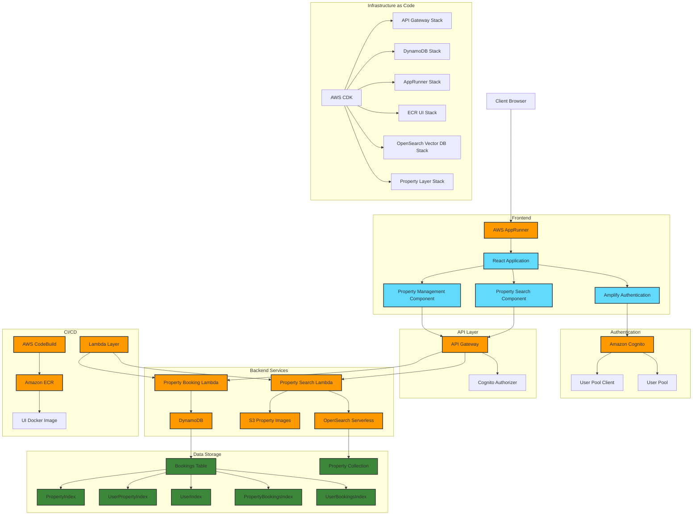

# Luxstay - Luxury Property Booking Application Architecture

## Architecture Diagram

## Architecture Overview

The Luxstay application is a luxury property booking platform built on AWS services. The architecture follows a modern serverless approach with a React frontend and AWS backend services.

### Key Components

#### Frontend
- **React Application**: A single-page application built with React, hosted on AWS AppRunner
- **Amplify Authentication**: Handles user authentication flows
- **Property Search Component**: Allows users to search for luxury properties
- **Property Management Component**: Enables property owners to manage their listings

#### Authentication
- **Amazon Cognito**: Manages user authentication and authorization
- **User Pool**: Stores user accounts and handles sign-up/sign-in
- **User Pool Client**: Client-side integration with the frontend

#### API Layer
- **API Gateway**: RESTful API interface for the frontend
- **Cognito Authorizer**: Ensures API requests are authenticated

#### Backend Services
- **Property Search Lambda**: Handles property search requests
- **Property Booking Lambda**: Processes booking requests
- **OpenSearch Serverless**: Provides fast, scalable property search capabilities
- **DynamoDB**: Stores booking data with multiple access patterns via GSIs
- **S3**: Stores property images with lifecycle management

#### Infrastructure as Code
- **AWS CDK**: Defines all infrastructure components
- **Multiple Stacks**: Organized by functionality (API, Database, Hosting, etc.)

#### CI/CD
- **Amazon ECR**: Stores Docker images for the UI
- **AWS CodeBuild**: Builds and deploys the application
- **Lambda Layers**: Provides shared code and dependencies for Lambda functions

### Data Flow

1. Users access the application through their browser, which loads the React application from AppRunner
2. Users authenticate using Cognito via the Amplify integration
3. Authenticated users can search for properties (via OpenSearch) or make bookings (stored in DynamoDB)
4. API Gateway routes requests to the appropriate Lambda functions
5. Lambda functions interact with the data stores (OpenSearch, DynamoDB, S3)
6. Property images are served from S3 with appropriate caching and lifecycle policies

### Security Considerations

- Authentication is handled by Cognito with secure password policies
- API Gateway uses Cognito authorizers to validate requests
- S3 bucket blocks public access and uses server-side encryption
- DynamoDB uses fine-grained access control
- OpenSearch collection has encryption and network policies

### Scalability

- Serverless architecture allows automatic scaling
- DynamoDB uses on-demand capacity for cost-effective scaling
- Multiple GSIs support various query patterns efficiently
- AppRunner automatically scales the frontend based on demand